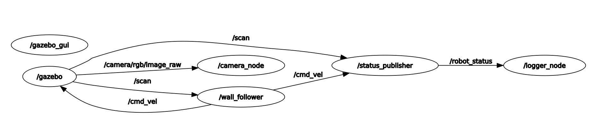

# Lab 4b - Robot Architecture (ROS / TurtleBot3)

This lab implements the control of a TurtleBot3 (`waffle_pi`) on top of ROS. The
application is split into several independent nodes that talk to each other only
through ROS topics and one service. ROS acts as the middleware: it carries the
sensor data, the drive commands and our own status message between the nodes,
and Gazebo provides the simulation for the whole system.

Two behaviours are implemented. A wall follower that keeps an even distance to a
wall and follows it, and a move-between node that drives back and forth between
two objects. Both behaviours run on the same supporting infrastructure (camera,
status publisher, logger, service); only the behaviour node at the end of the
chain changes.

## Running the Project

The robot model has to be `waffle_pi`, because only the waffle models carry a
camera. Both launch files set the model themselves (`move_between.launch` when it
spawns the robot, `wall_follower.launch` by passing `model:=waffle_pi` into the
included world), so the environment variable is not required. If you also use
TurtleBot3 tools that read it directly, such as `turtlebot3_teleop`, you can set
it once in the shell or in `~/.bashrc`:

```shell
export TURTLEBOT3_MODEL=waffle_pi
```

Build the workspace and source it:

```shell
cd ~/catkin_ws
catkin_make
source devel/setup.bash
```

Then start one of the two behaviours:

```shell
roslaunch turtlebot3_control wall_follower.launch
roslaunch turtlebot3_control move_between.launch
```

Each launch file brings up Gazebo, spawns the robot and starts all nodes. The
camera node opens two OpenCV windows, the logger writes a CSV file into the
`logs/` folder, and the robot starts to move on its own.

## Architecture

The application does not run as one program. It runs as a set of separate
processes (nodes), and ROS connects them. Nodes never call each other directly.
They publish messages on a named topic, and any node interested in that topic
subscribes to it. Neither side knows the other, they only agree on the topic name
and the message type. This is the publish/subscribe model, and it is what makes
the nodes replaceable: a behaviour node only has to read `/scan` and write
`/cmd_vel`, so the two behaviours plug into the exact same infrastructure without
any other node noticing the difference.

There is one place where publish/subscribe is the wrong tool: switching logging
on and off. That is a request that expects an answer, not a stream of data, so it
is modelled as a ROS service instead of a topic.

The node graph is the same for both behaviours, only the last node changes:

<p align="center">
  
</p>

The following table lists every node with the topics it consumes and produces.
The topic names and message types are the contract between the nodes.

| Node               | Subscribes / calls                  | Publishes / serves           |
|--------------------|-------------------------------------|------------------------------|
| `camera_node`      | `/camera/rgb/image_raw`             | OpenCV windows (no topic)    |
| `status_publisher` | `/scan`, `/cmd_vel`                 | `/robot_status`              |
| `logger_node`      | `/robot_status`, `/set_logging`     | CSV file                     |
| `wall_follower`    | `/scan`                             | `/cmd_vel`                   |
| `move_between`     | `/scan`                             | `/cmd_vel`                   |

## Building Blocks

### Custom Message: `RobotStatus`

The assignment asks for a custom message that carries the current velocity
command and the relevant LiDAR distances. We defined it as five `float64` fields:

```
float64 linear_speed
float64 angular_speed
float64 distance_front
float64 distance_left
float64 distance_right
```

The velocity part is the actual command on `/cmd_vel`, and the three distances
are the front, left and right readings of the LiDAR. The message is generated at
build time by `message_generation`, which produces the
`turtlebot3_control::RobotStatus` C++ type that the publisher and the logger
share.

### Service: `/set_logging`

Logging is switched with a standard `std_srvs/SetBool` service. We did not need
a custom service type, because the request is a single boolean and the response
is just success plus a message. The service lives inside the logger node rather
than in a node of its own, since it only flips a flag that the logger owns. It
therefore needs no separate node and no extra entry in the launch files: starting
the logger starts the service with it.

### `camera_node`

The camera node subscribes to `/camera/rgb/image_raw` and converts each incoming
ROS image to an OpenCV `cv::Mat` with `cv_bridge`. The conversion uses the
`bgr8` encoding, which is the colour layout OpenCV expects. The conversion is
wrapped in a `try/catch`, because a mismatched encoding throws and would
otherwise kill the node.

The image processing itself is a grayscale conversion followed by Canny edge
detection. Both the original frame and the edge image are shown in their own
OpenCV window. The `cv::waitKey(1)` at the end is not optional: without it the
windows never process their GUI events and stay blank.

### `status_publisher`

The status publisher is the only node that produces the `RobotStatus` message.
It subscribes to `/scan` and `/cmd_vel`, keeps the latest values in plain
variables, and publishes a fresh `RobotStatus` at a fixed 10 Hz in its main
loop. Decoupling the callbacks from the publish rate this way means the output
rate is steady and does not depend on how fast the sensor happens to fire.

The LiDAR readings are taken at three fixed indices: `0` for the front, `90` for
the left and `270` for the right. Each reading goes through a small `readRange`
helper that replaces invalid values (`inf`, `NaN`, or anything outside the
sensor's `range_min`/`range_max`) with `range_max`, so the message never carries
garbage distances.

### `logger_node`

The logger subscribes to `/robot_status` and appends one CSV line per message,
each line prefixed with a timestamp from `ros::Time::now()`. The file is created
once at start-up, with a header row and `std::fixed` formatting so the timestamp
is written as a plain decimal instead of scientific notation.

The file name carries the current date, built with `strftime`, so each day gets
its own log:

```
log_19_06_2026.csv
```

The path is resolved at runtime with `ros::package::getPath("turtlebot3_control")`
and the file is placed in the package's `logs/` folder. We do this instead of a
relative name because, when started through `roslaunch`, the working directory is
`~/.ros` and a relative name would put the log there instead of in the package.

The service callback only sets the `logging_enabled` flag. The actual gate is one
line at the top of the message callback:

```cpp
if (!logging_enabled) return;   // when off, write nothing
```

This satisfies the requirement that no new entries are written while logging is
off. Logging starts enabled.

### `wall_follower`

The wall follower keeps the wall on its right and follows it with a simple
rule-based controller. It reads three sectors of the LiDAR, each as the minimum
over a small window rather than a single beam, so a single missing ray cannot
upset the decision:

| Sector        | Centre  | Purpose                          |
|---------------|---------|----------------------------------|
| front         | 0°      | detect a wall straight ahead     |
| right         | 270°    | hold the distance to the wall    |
| front-right   | 315°    | see an inside corner early       |

The decision each cycle is a short cascade. If there is a wall in front or the
front-right is already too close, the robot stops driving forward and turns in
place to escape the corner. Otherwise it drives forward and only corrects its
heading: if the right distance is larger than the target it steers towards the
wall, if it is smaller it steers away, and inside the tolerance band it goes
straight. The target distance is 0.3 m with a 0.1 m tolerance, which is the band
that keeps the motion from oscillating.

### `move_between`

The move-between node drives back and forth between the two boxes. Instead of one
LiDAR beam it evaluates a front cone of ±25° and reduces it to two values: the
nearest distance in the cone (`front_min`) and the angle to that nearest point
(`front_bearing`, positive to the left). The bearing is the key value, because it
tells the node not just *whether* an object is ahead but *where* it is.

The node is a two-state machine:

- **DRIVE:** drive forward while steering the object to the centre with a
  proportional term, `angular.z = STEER_GAIN * front_bearing`. This makes the
  robot approach the box head-on instead of drifting past it. When `front_min`
  drops below the stop distance, switch to TURN.
- **TURN:** rotate in place. First turn until the front is clear of the box just
  reached (`cleared`), then keep turning until the other box is centred ahead
  again. A timeout acts as a fallback so the node can never get stuck.

The important design point is that the turn is closed by the sensor, not by a
timed open-loop 180°. A fixed turn duration drifts a little every cycle because
of acceleration ramps and physics, and the error accumulates until the robot
faces empty space. Turning until the next object is actually centred removes that
drift entirely, and the steering term in DRIVE corrects whatever small error is
left.

## Simulation Environment

The move-between behaviour uses its own world, `worlds/two_objects.world`. It
contains a ground plane, a light, and two static boxes of 0.5 m placed at `x = +2`
and `x = -2`. The robot is spawned at the origin, exactly between them. The boxes
are static so they do not move when the robot bumps the air around them.

The wall follower uses the stock `turtlebot3_world` from `turtlebot3_gazebo`,
which already provides walls to follow. Either world can be swapped for another
stage; nothing in the nodes is tied to a specific map.

## Launch Files

Each behaviour has its own launch file, and both start the full set of nodes the
assignment requires: the camera node, the status publisher, the logger (which
also hosts the service), and the matching behaviour node.

- **`move_between.launch`** loads an empty world with `two_objects.world`, spawns
  the `waffle_pi` at the origin, and starts the four nodes ending in
  `move_between`.
- **`wall_follower.launch`** includes `turtlebot3_world.launch` (with the model
  set to `waffle_pi`) and starts the four nodes ending in `wall_follower`.

## Properties of the Architecture

### Loose Coupling

No node holds a reference to another node. They share only topic names and
message types. Because of that, the two behaviour nodes are interchangeable: both
read `/scan` and write `/cmd_vel`, so the camera, status publisher and logger do
not change at all when we switch behaviours. The same property lets us replace
the simulator with a different world, or in principle a real robot, without
touching the nodes.

### Separation of Concerns

Each node does one job. The camera node only looks at images, the status
publisher only assembles the status message, the logger only writes it down, and
the behaviour node only decides how to move. This keeps every node small and
makes it possible to test or restart one of them on its own.

### Synchronous vs. Asynchronous Communication

Most of the system is asynchronous: data flows over topics, and a publisher does
not wait for its subscribers. Logging control is the exception. Turning logging
on or off is a synchronous request that expects a reply, which is why it is a
service and not a topic. Choosing the right one of the two for each case is part
of the architecture, not an afterthought.

---

The package contains the five nodes, the custom message, the service usage, the
two worlds and the two launch files. The TurtleBot3 description, the Gazebo
launch files and the simulator are used as provided and are not modified.
