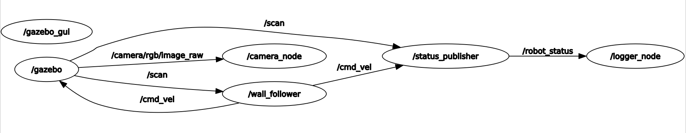
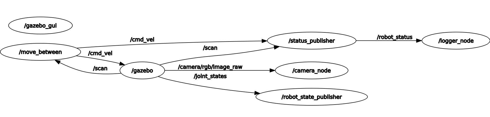
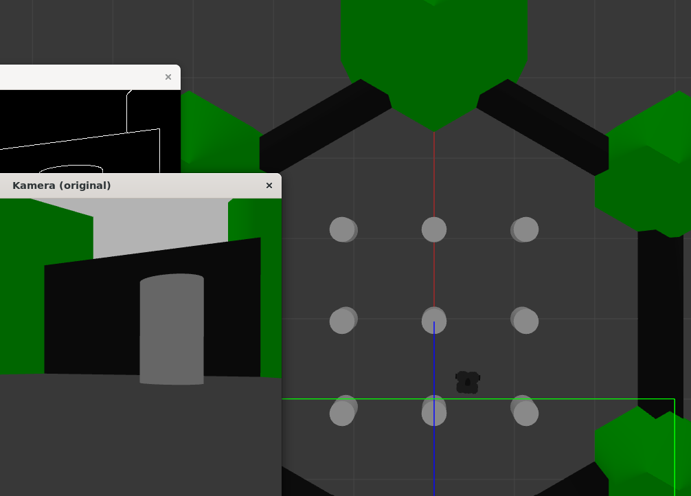
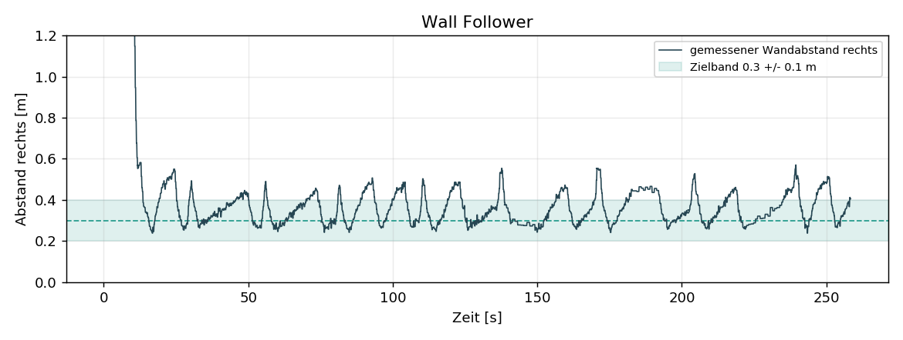
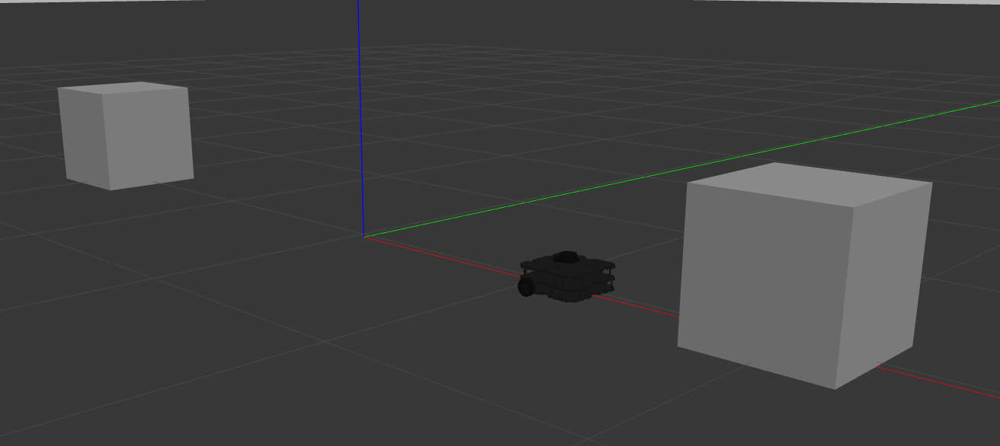
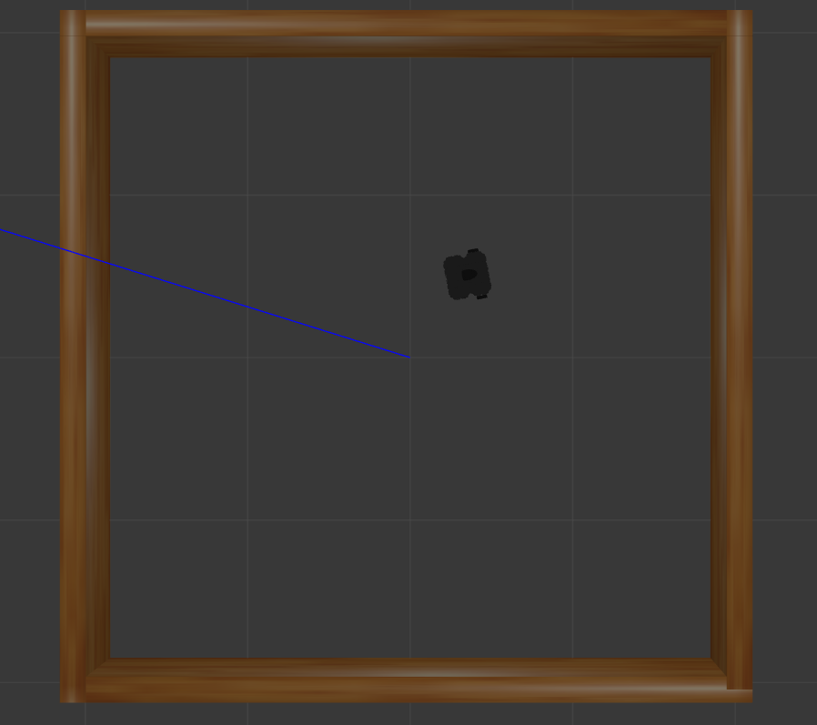
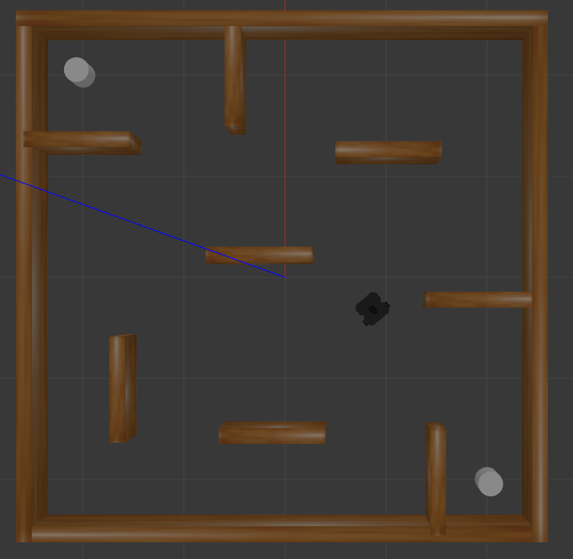

# Lab 4b - Robot Architecture (ROS / TurtleBot3)

This lab controls a TurtleBot3 (waffle_pi) with ROS. The application is split
into several small nodes. The nodes only talk to each other through ROS topics
and one service. ROS works as the middleware. It carries the sensor data, the
drive commands and our own status message between the nodes. Gazebo runs the
simulation for the whole system.

We built two behaviours. The wall follower keeps an even distance to a wall and
follows it. The move-between node drives back and forth between two objects. Both
behaviours use the same supporting nodes: the camera, the status publisher, the
logger and the service. Only the last node in the chain, the behaviour node,
changes.

## Running the Project

The robot model has to be `waffle_pi`. Only the waffle models carry a camera.
The launch files set the model themselves. `move_between.launch` sets it when it
spawns the robot. The wall follower launch files set it by passing
`model:=waffle_pi` into the included world. So the environment variable is not
needed for our nodes. You only need it if you also use TurtleBot3 tools that read
it directly, such as `turtlebot3_teleop`. In that case set it once in the shell
or in `~/.bashrc`:

```shell
export TURTLEBOT3_MODEL=waffle_pi
```

Build the workspace and source it:

```shell
cd ~/catkin_ws
catkin_make
source devel/setup.bash
```

Then start one of the behaviours:

```shell
roslaunch turtlebot3_control move_between.launch
roslaunch turtlebot3_control wall_follower.launch
roslaunch turtlebot3_control wall_follower_stage1.launch
roslaunch turtlebot3_control wall_follower_stage4.launch
```

Each launch file brings up Gazebo, spawns the robot and starts all nodes. The
camera node opens two OpenCV windows. The logger writes a CSV file into the
`logs/` folder. The robot then starts to move on its own.

## Architecture

The application does not run as one program. It runs as a set of separate
processes (nodes). ROS connects them. Nodes never call each other directly. A
node publishes messages on a named topic. Any node that is interested in that
topic subscribes to it. Neither side knows the other. They only agree on the
topic name and the message type. This is the publish and subscribe model. It is
the reason the nodes are replaceable. A behaviour node only has to read `/scan`
and write `/cmd_vel`. So the two behaviours plug into the exact same
infrastructure and no other node has to change.

There is one case where publish and subscribe is the wrong tool. Switching
logging on and off is a request that expects an answer. It is not a stream of
data. So we modelled it as a ROS service and not as a topic.

### Node Graph

The node graph is almost the same for both behaviours. They share the same
supporting nodes. Only the behaviour node and one detail in the setup differ.
These are the real `rqt_graph` captures of each run.

**Wall follower**

<p align="center">
  
</p>


**Move between**

<p align="center">
  
</p>

The move-between graph also shows `/robot_state_publisher` and `/joint_states`.
Both behaviours actually run that node. The wall follower gets it from the
included `turtlebot3_world.launch`. The move-between launch builds an empty world
and spawns the robot itself, so it has to start the `robot_state_publisher` on
its own. Otherwise nothing would publish the robot frames. The graphs look a
little different only because of this.

The following table lists every node with the topics it reads and writes. The
topic names and message types are the contract between the nodes.

| Node               | Subscribes / calls               | Publishes / serves        |
|--------------------|----------------------------------|---------------------------|
| `camera_node`      | `/camera/rgb/image_raw`          | OpenCV windows (no topic) |
| `status_publisher` | `/scan`, `/cmd_vel`              | `/robot_status`           |
| `logger_node`      | `/robot_status`, `/set_logging`  | CSV file                  |
| `wall_follower`    | `/scan`                          | `/cmd_vel`                |
| `move_between`     | `/scan`                          | `/cmd_vel`                |

The service `/set_logging` does not show up in the node graph. That is normal.
`rqt_graph` draws topics, not services.

## Building Blocks

### Custom Message: `RobotStatus`

The assignment asks for a custom message. It has to carry the current velocity
command and the relevant LiDAR distances. We defined it with five `float64`
fields plus a standard header.

```
std_msgs/Header header
float64 linear_speed
float64 angular_speed
float64 distance_front
float64 distance_left
float64 distance_right
```

The velocity part is the actual command on `/cmd_vel`. The three distances are
the front, left and right readings of the LiDAR. We added the header on purpose.
It carries the time stamp of the measurement, so the logger can write the time
the data was taken and not the time it happened to be written. The message is
generated at build time by `message_generation`. This produces the
`turtlebot3_control::RobotStatus` C++ type that the publisher and the logger
share.

### Service: `/set_logging`

Logging is switched with the standard `std_srvs/SetBool` service. We did not need
a custom service type. The request is a single boolean. The response is just a
success flag and a short message. The service lives inside the logger node and
not in a node of its own. It only flips a flag that the logger owns. So it needs
no separate node and no extra entry in the launch files. Starting the logger
starts the service with it.

### `camera_node`

The camera node subscribes to `/camera/rgb/image_raw`. It converts each incoming
ROS image to an OpenCV `cv::Mat` with `cv_bridge`. The conversion uses the `bgr8`
encoding. That is the colour layout OpenCV expects. We wrapped the conversion in
a `try` and `catch` block. A wrong encoding throws an exception and would
otherwise stop the node.

The image processing is a grayscale conversion followed by Canny edge detection.
Both the original frame and the edge image are shown in their own OpenCV window.
The `cv::waitKey(1)` at the end is not optional. Without it the windows never
process their GUI events and stay blank.

The picture below shows the wall follower running in `turtlebot3_world`. On the
left you can see the two camera windows: the original frame ("Kamera (original)")
and the Canny edge image on top of it.

<p align="center">
  
</p>


### `status_publisher`

The status publisher is the only node that produces the `RobotStatus` message. It
subscribes to `/scan` and `/cmd_vel`. It keeps the latest values in plain
variables. It then publishes a fresh `RobotStatus` at a fixed 10 Hz in its main
loop. We decoupled the callbacks from the publish rate on purpose. This way the
output rate is steady and does not depend on how fast the sensor happens to fire.

The three LiDAR readings are taken at configurable angles. The defaults are 0
degrees for the front, 90 degrees for the left and 270 degrees for the right.
Each reading is not a single beam. It is the minimum over a small window around
the angle. A helper called `minRange` does this. It also throws out invalid
values like `inf`, `NaN` or anything outside the sensor range. If the whole
window is invalid it returns `range_max`. So the message never carries garbage
distances.

### `logger_node`

The logger subscribes to `/robot_status`. It appends one CSV line per message.
Each line starts with the time stamp from the message header, which is the time
the measurement was taken. The file is created once at start up. It gets a header
row and `std::fixed` formatting, so the time stamp is written as a plain decimal
and not in scientific notation.

The file name carries the current date and time. It is built with `strftime`. So
every run gets its own log and old logs are never overwritten.

```
log_24_06_2026_190646.csv
```

The path is resolved at runtime with
`ros::package::getPath("turtlebot3_control")`. The file is then placed in the
`logs/` folder of the package. We do this instead of a relative name for a
reason. When a node is started through `roslaunch`, the working directory is
`~/.ros`. A relative name would put the log there and not in the package.

The service callback only sets the `logging_enabled` flag. The real gate is one
line at the top of the message callback.

```cpp
if (!logging_enabled) return; // when off, write nothing
```

This meets the requirement that no new entries are written while logging is off.
Logging starts enabled.

### `wall_follower`

The wall follower keeps the wall on its right and follows it with a simple
rule-based controller. It reads three sectors of the LiDAR. Each sector is the
minimum over a small window and not a single beam. So one missing ray cannot
upset the decision.

| Sector      | Centre | Purpose                       |
|-------------|--------|-------------------------------|
| front       | 0°     | detect a wall straight ahead  |
| right       | 270°   | hold the distance to the wall |
| front-right | 315°   | see an inside corner early    |

The decision each cycle is a short cascade. If there is a wall in front, or the
front-right is already too close, the robot stops driving forward and turns in
place to escape the corner. Otherwise it drives forward and only corrects its
heading. If the right distance is larger than the target, it steers towards the
wall. If it is smaller, it steers away. Inside the tolerance band it goes
straight. The target distance is 0.3 m with a 0.1 m tolerance. This is the band
that keeps the motion from swinging back and forth.

To check that the controller really works, we read the right distance back from a
log file and plotted it over time. The dashed line is the target of 0.3 m and the
shaded band is the tolerance of plus and minus 0.1 m. The distance stays inside
or close to the band the whole run. Each little hill is one corner: the robot
moves a bit away from the wall to turn, then comes back to the target distance.

<p align="center">
  
</p>


### `move_between`

The move-between node drives back and forth between the two boxes. It looks at a
front cone of plus and minus 90 degrees. Instead of using one beam, it groups the
LiDAR returns into objects. This is a small clustering step. Two neighbouring
returns belong to the same object when their distance is close. A jump in
distance larger than `cluster_gap` starts a new object. Objects with fewer than
`min_points` returns are dropped as noise.

Each object is reduced to two numbers. The first is its distance, taken as the
nearest point of the object. The second is its bearing, taken as the mean angle
of the object. A positive bearing means the object is to the left. From all
objects in the cone, the node picks the one with the smallest absolute bearing.
That is the object most directly ahead.

The node is a two-state machine.

- **DRIVE.** Drive forward and steer the chosen object to the centre with a
  proportional term, `angular.z = steer_gain * bearing`. So the robot approaches
  the box head on and does not drift past it. If no object is ahead, the node
  turns slowly in place to search for one. When the object gets closer than the
  stop distance, switch to TURN.
- **TURN.** Rotate in place. First turn until the box just reached is no longer
  ahead. This is the `cleared` step. Then keep turning until the other box is
  centred ahead again. A timeout of one full rotation acts as a fallback, so the
  node can never get stuck.

The key point is that the turn is closed by the sensor and not by a timed
open-loop 180 degrees. Why the turn has two phases, and why that beats a fixed
turn, is explained under Design Decisions.

The picture below shows the move-between world: the robot starts at the origin,
exactly between the two boxes.

<p align="center">
  
</p>

## Simulation Worlds (Stages)

The nodes are not tied to one map. The wall follower can run in any world that
has walls, and we test it in three of them. The move-between node uses its own
custom world. Here is what each one is for.

### `turtlebot3_world` (default wall follower)

This is the stock world from `turtlebot3_gazebo`. It has an outer hexagon wall
and a few cylinders in the middle. `wall_follower.launch` uses it. It is a good
first test because the robot can follow the outer wall all the way around. You can
see this world in the camera-node picture further up.

### Stage 1 (`wall_follower_stage1.launch`)

Stage 1 is the simplest map: an empty square room with four straight walls. There
are no obstacles inside. This is the easiest case for the wall follower, so it is
nice for a first run. The robot just follows the four walls around the square.

<p align="center">
  
</p>

### Stage 4 (`wall_follower_stage4.launch`) - best showcase

Stage 4 is the most interesting map. It is a square room with many extra inner
walls and obstacles, almost like a small maze. There are many corners and short
wall pieces to follow. **This is where the wall follower works best and where you
can see the behaviour most clearly.** The robot follows a wall, reaches a corner,
turns to escape it, and picks up the next wall. With so many walls and corners,
the full logic of the controller is on display. We recommend this stage for the
demo.

<p align="center">
  
</p>

### `two_objects.world` (move-between)

The move-between behaviour uses its own world, `worlds/two_objects.world`. It
contains a ground plane, a light and two static boxes of 0.5 m. One box sits at
`x = +2` and the other at `x = -2`. The robot is spawned at the origin, exactly
between them. The boxes are static, so they do not move when the robot drives near
them. The screenshot for this world is in the `move_between` section above.

## Launch Files

Each behaviour has its own launch file. Every one starts the full set of nodes the
assignment asks for. These are the camera node, the status publisher, the logger
(which also hosts the service) and the matching behaviour node.

- **`move_between.launch`** loads an empty world with `two_objects.world`, spawns
  the `waffle_pi` at the origin and starts the four nodes ending in
  `move_between`.
- **`wall_follower.launch`** includes `turtlebot3_world.launch` with the model set
  to `waffle_pi` and starts the four nodes ending in `wall_follower`.
- **`wall_follower_stage1.launch`** is the same setup, but in the stock
  `turtlebot3_stage_1` world.
- **`wall_follower_stage4.launch`** is the same setup, but in the stock
  `turtlebot3_stage_4` world (the best stage to watch the wall follower).

Only the world and the behaviour node change between the launch files. All four
supporting nodes stay the same.

## Design Decisions

This section explains the choices that are not obvious from the code alone. For
each one we also name the simpler alternative and say why we did not take it.

**Everything is a parameter, including the topic names.** Every value a node uses
is a ROS parameter with a default: the LiDAR angles, the speeds, the distance
thresholds, the loop rate, and even the topic names like `scan_topic` and
`cmd_topic`. The launch files only override what they need. There are two reasons.
First, we can retune a behaviour straight from the launch file without
recompiling, which saved a lot of time while testing. Second, because the topic
names are parameters too, the same node could be pointed at a real robot or a
different simulator by remapping, without changing a single line of code. The
defaults are picked so that every node also runs correctly on its own with no
launch file.

**The status publisher only watches the command bus.** The assignment asks the
status message to carry the *current velocity command*. We get this by
subscribing to `/cmd_vel` and copying the last command. We do not read the real
wheel velocity from odometry. This is also an architecture choice: the status
publisher does not know which behaviour is running. It just listens to whatever is
on `/cmd_vel`. That is the reason one single status publisher serves both the wall
follower and move-between with no change. It is an observer of the bus, not a part
of either behaviour.

**Hysteresis everywhere a decision could flip back and forth.** A controller that
switches the moment a value crosses one threshold will chatter: it flips state
many times a second and the robot shakes. We avoid this by leaving a gap between
"on" and "off" in three places.

- The wall follower aims for 0.3 m but only steers once the distance leaves a band
  of plus and minus 0.1 m. Inside the band it drives straight.
- In move-between the robot stops at `stop_distance`, but only counts the box as
  "cleared" once it is more than two times that distance away (`clear_factor`).
  The gap between stopping and clearing keeps the TURN state from flickering.
- It also only locks onto a new box once the bearing is inside a small angle
  window (`center_tol`), not the instant it touches zero.

It is the same idea each time: leave room between the two thresholds so a small
wobble in the sensor cannot change the decision.

**The two-phase turn in move-between.** The naive way to turn around is to rotate
180 degrees and hope the other box is now in front. We do not do that, because a
fixed turn drifts a little every cycle and the error adds up. Instead the TURN
state has two phases. First it turns until the box it just visited is no longer
ahead (the `cleared` flag). Only then does it start looking for the next box to
centre on. The order is the whole point. Right after the robot reaches box A, box
A is still the closest and most-centred object. If it looked for a centred object
straight away, it would lock onto box A again and never leave. By forcing "A is
gone" before "B is found", the robot is guaranteed to turn away from the box it
came from and towards the other one. A timeout of one full rotation is a safety
net so it can never spin forever.

**CSV instead of JSON for the log.** The assignment allowed either. We chose CSV
because the logger appends one line per message as a stream. CSV is made for
exactly that: open the file once, write a header, then keep adding rows. A JSON
array cannot be appended cleanly while the file is still open. CSV also loads in a
single line into pandas or a spreadsheet, which is how we made the wall-follower
distance plot from a real run.

**The camera stream is handled differently from the sensor streams.** Camera
images are large and arrive fast. For the image subscription we set the queue size
to 1, while the LiDAR and command subscriptions use 10. With a queue of 1 an old
frame is dropped as soon as a new one arrives, so the node always works on the
latest image and never builds a backlog of stale frames. We also convert the image
with `toCvShare` and not `toCvCopy`. `toCvShare` does not copy the image data, it
only borrows it. That is safe here because we never write into the original frame:
the grayscale and edge results go into new images.

**"No reading" means different things in the two LiDAR helpers.** There is a
`minRange` helper in the status publisher and a similar one in the wall follower.
They differ in what they return when a sector has no valid reading at all. The
status publisher returns `range_max`, so a logged distance is always a real,
capped number and the log never contains infinity. The wall follower returns
infinity, which is exactly what we want there: if the right sector sees no wall, an
infinite distance reads as "far too far from the wall", and the controller steers
towards the wall to find it again. So an empty right side simply turns into a
search for the wall.

## Properties of the Architecture

### Loose Coupling

No node holds a reference to another node; they share only topic names and message
types. Because both behaviour nodes read `/scan` and write `/cmd_vel`, they are
interchangeable, and the camera, status publisher and logger never change when we
switch behaviours. The same property lets us swap the world, or in principle run
on a real robot, without touching the nodes.

### Separation of Concerns

Each node does one job. The camera node only looks at images. The status
publisher only assembles the status message. The logger only writes it down. The
behaviour node only decides how to move. This keeps every node small. It also
makes it possible to test or restart one node on its own.

### Synchronous vs. Asynchronous Communication

Almost everything flows over topics, where a publisher does not wait for its
subscribers. The one exception is logging control, which is a request expecting a
reply and is therefore a service. Picking the right one of the two per case is
part of the design, not an afterthought.

---

The package contains the five nodes, the custom message, the service usage, one
custom world (`two_objects.world`) and four launch files. The TurtleBot3
description, the Gazebo launch files, the stock stage worlds and the simulator are
used as provided and are not modified.